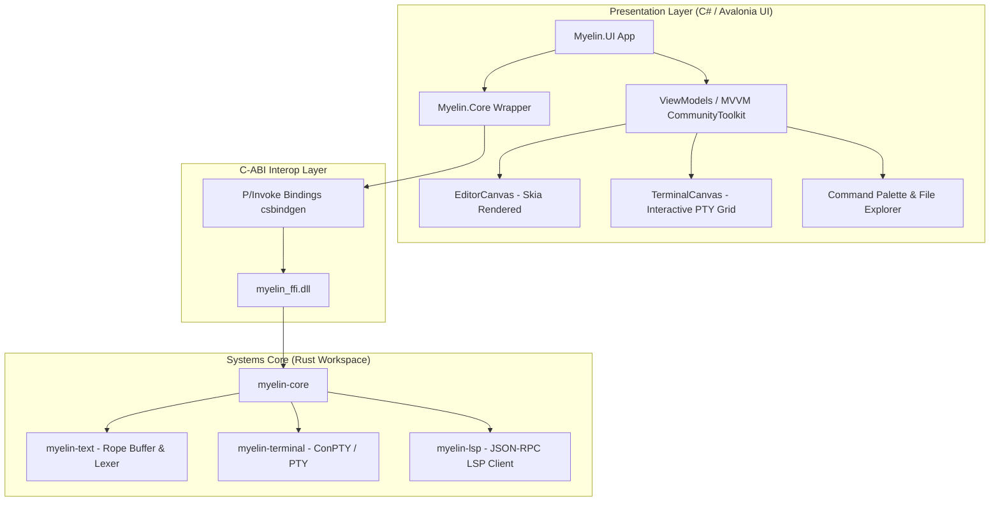

# Myelin IDE

[](https://www.rust-lang.org/)
[](https://dotnet.microsoft.com/)
[](https://avaloniaui.net/)
[](LICENSE)

**Myelin** is a high-performance, polyglot Integrated Development Environment (IDE) built with a decoupled two-tier architecture:
- **Core Engine (Rust)**: Memory-safe, high-throughput text rope buffers, transactional history (undo/redo), language server protocol (LSP) client infrastructure, and native ConPTY/PTY terminal execution.
- **Frontend Client (C# / .NET 8 / Avalonia UI)**: Cross-platform, hardware-accelerated presentation layer featuring custom Skia-rendered canvases, VS Code Dark+ aesthetics, and Material Icon themes.

---

## Architecture Overview



---

## Key Features

- ⚡ **High-Throughput Text Engine**: Powered by `crop::Rope`, providing $O(\log N)$ text insertions, deletions, and slicing for large files.
- 🎨 **Hardware-Accelerated Editor Canvas**: Custom Skia-based text rendering surface with multi-token syntax highlighting, line numbers, cursor blinking, selection tracking, and copy/paste support.
- 💻 **Native ConPTY Terminal**: Direct keystroke streaming into interactive PowerShell/bash processes with VT/ANSI escape code parsing, scrollback history, and copy/paste.
- 🛠️ **Cargo Integration & Diagnostics**: Run `cargo build`, `cargo check`, `cargo test`, and `cargo run` directly from the IDE with automatic file auto-saving and live compiler error parsing into the Problems tab.
- 📂 **Rich File Explorer**: Material Icon theme integration with over 2,000 file/folder vector SVG icons.
- 🔍 **Command Palette & Quick Open**: Instant fuzzy search across workspace commands and files (`Ctrl+Shift+P` / `Ctrl+P`).
- 🔄 **Safe Undo/Redo Engine**: Reversible transaction stack ensuring undo/redo consistency across multi-byte UTF-8 edits.

---

## Repository Structure

| Directory | Description |
|---|---|
| [`crates/`](crates/) | Rust systems core (workspace containing 5 crates) |
| ├── [`crates/myelin-text/`](crates/myelin-text/) | Piece table / rope buffer, 2D coordinates, tokenizer, undo/redo history |
| ├── [`crates/myelin-core/`](crates/myelin-core/) | Workspace document manager, directory scanner |
| ├── [`crates/myelin-terminal/`](crates/myelin-terminal/) | ConPTY / PTY session manager with async background I/O |
| ├── [`crates/myelin-lsp/`](crates/myelin-lsp/) | Language Server Protocol (LSP) client infrastructure |
| └── [`crates/myelin-ffi/`](crates/myelin-ffi/) | C-ABI export layer compiling `myelin_ffi.dll` |
| [`apps/desktop/`](apps/desktop/) | .NET 8 / Avalonia UI desktop application |
| ├── [`apps/desktop/src/Myelin.Core/`](apps/desktop/src/Myelin.Core/) | Safe C# wrappers and P/Invoke bindings |
| ├── [`apps/desktop/src/Myelin.UI/`](apps/desktop/src/Myelin.UI/) | Avalonia UI workbench, views, canvases, view models |
| └── [`apps/desktop/tests/`](apps/desktop/tests/) | Unit & interop test suite |
| [`bindings/`](bindings/) | Auto-generated P/Invoke interop code |
| [`run.bat`](run.bat) | One-click Windows build and launch script |

---

## Getting Started

### Prerequisites

1. **Rust Toolchain (1.75+)**:
   ```bash
   rustup default stable
   ```
2. **.NET 8 SDK**:
   ```bash
   dotnet --version
   # Expected: 8.0.x
   ```

### Quick Launch (Windows)

Simply run the root launch script:
```cmd
.\run.bat
```
`run.bat` automatically compiles the native Rust core (`myelin_ffi.dll`) if not already present and launches the Avalonia frontend.

### Manual Build

1. **Build Native Rust Engine**:
   ```bash
   cargo build --workspace
   ```
   This generates `target/debug/myelin_ffi.dll`.

2. **Build and Run C# Desktop Client**:
   ```bash
   dotnet build apps/desktop/Myelin.sln
   dotnet run --project apps/desktop/src/Myelin.UI/Myelin.UI.csproj
   ```

### Running Tests

- **Run Rust Core Unit Tests**:
  ```bash
  cargo test --workspace
  ```
- **Run .NET Interop Tests**:
  ```bash
  dotnet test apps/desktop/Myelin.sln
  ```

---

## Keyboard Shortcuts

| Shortcut | Action |
|---|---|
| `Ctrl+N` | New Untitled File |
| `Ctrl+O` | Open File |
| `Ctrl+Shift+O` | Open Folder |
| `Ctrl+S` | Save Active File |
| `Ctrl+Shift+S` | Save Active File As |
| `Ctrl+W` | Close Active Tab |
| `Ctrl+Z` | Undo |
| `Ctrl+Y` / `Ctrl+Shift+Z` | Redo |
| `Ctrl+Shift+P` | Open Command Palette |
| `Ctrl+P` | Quick Open File |
| `Ctrl+B` | Toggle Sidebar |
| `Ctrl+J` / `Ctrl+~` | Toggle Bottom Panel (Terminal / Output / Problems) |
| `Ctrl+Shift+B` | Cargo Build Workspace |
| `F5` | Cargo Run Active Project |

---

## License

This project is licensed under the terms of the MIT License or Apache-2.0 License at your option.
